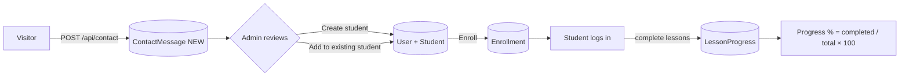
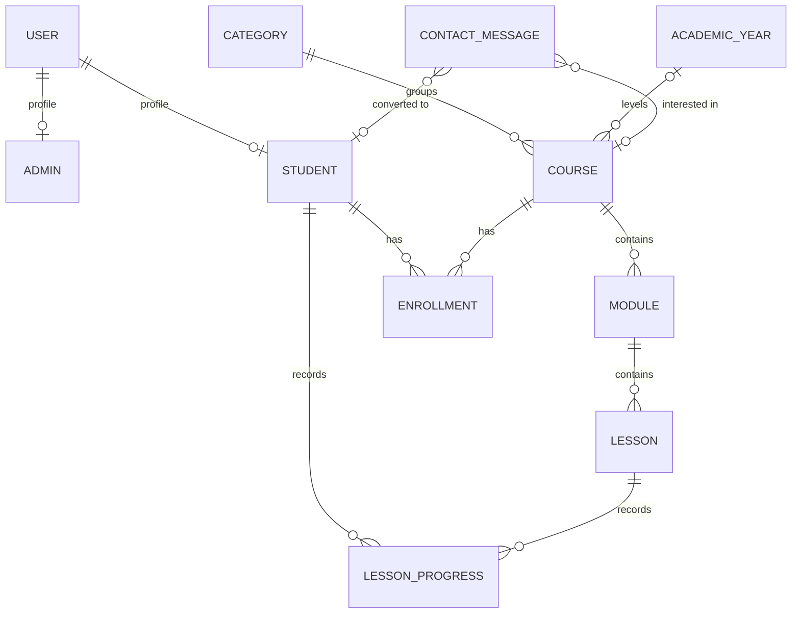

# Phase 1 — Product Architecture

The platform is **Premium EdTech website + mini LMS + admin system**, built around two workflows (Admin and Student). The seed courses are only the first rows in the database; nothing in the front-end knows about Flutter, Java or Accounting.

```
Browser (React SPA)  ──/api──▶  Express 5 API  ──Mongoose──▶  MongoDB
  Public · /admin · /student      auth · RBAC · Zod             11 collections
```

## 1. Roles and permissions

| Capability | Visitor | Student | Admin |
|---|:-:|:-:|:-:|
| Browse **published** courses, course detail (syllabus titles only), categories, public settings | ✅ | ✅ | ✅ |
| Submit a contact request | ✅ | ✅ | ✅ |
| Read lesson content / video / resources | ❌ | ✅ only for courses they are enrolled in | ✅ |
| Mark lessons complete, see own progress, edit own phone/photo/password | ❌ | ✅ (own data only) | ❌ (not applicable) |
| Manage courses, modules, lessons, categories, academic years | ❌ | ❌ | ✅ |
| Manage students, enrollments, contact requests, settings, statistics | ❌ | ❌ | ✅ |

Authorization is enforced **in the API** (`authenticate` → `requireRole` → per-resource ownership checks). The front-end guards only improve UX; they are never the security boundary.

## 2. User journeys

- **Visitor** — Landing → Explore courses → Course detail → *Request information* (contact form pre-filled with the course) → request stored in the database.
- **Admin** — Login → Dashboard (live stats) → Courses (wizard: basics → descriptions → modules & lessons → pricing/settings → preview & publish) → Students → Enrollments → Contact requests (create/link student, enroll).
- **Student** — Login → Dashboard (progress per course) → Course → Modules → Lessons → *Mark complete* → progress recalculated from real completions.

## 3. Lead-to-learner pipeline



Duplicate prevention: creating a student with an e-mail that already exists returns `409 EMAIL_TAKEN` with the existing student's id; a contact request shows the student already matching its e-mail, and offers *Add to existing student*.

## 4. Data model (MongoDB / Mongoose)

The spec asked for foreign keys; MongoDB has none, so integrity is enforced by **ObjectId references + unique/compound indexes + service-level rules** (documented per relation below). No multi-document transactions are used, so the API also runs on a standalone `mongod` (only Atlas/replica sets have them); multi-step writes are ordered so a failure leaves nothing dangling, with compensation where needed.



| Collection | Key fields | Indexes | Referential rules |
|---|---|---|---|
| `users` | email, passwordHash (argon2id, never returned), role, tokenVersion, mustChangePassword | unique `email` | 1‑to‑1 with `admins`/`students` |
| `admins` | user, firstName, lastName | unique `user` | |
| `students` | user, firstName, lastName, phone, dateOfBirth, address, profilePhotoUrl, status | unique `user`, `status`, `createdAt` | student is **deactivated, never hard-deleted**; inactive students cannot authenticate |
| `categories` | slug, name_en/fr, description_en/fr, sortOrder | unique `slug` | delete blocked while courses use it |
| `academicyears` | slug, name_en/fr, sortOrder | unique `slug` | delete blocked while courses use it |
| `courses` | slug, title/shortDescription/description `_en/_fr`, category, academicYear?, level, durationValue+Unit, price, showPrice, currency, thumbnail, status, publishedAt, objectives[], audience[], skills[], faq[], project | unique `slug`, `{status, category}`, `{status, academicYear}` | delete blocked while enrollments exist (archive instead); deleting cascades modules → lessons → progress |
| `modules` | course, title_en/fr, description_en/fr, order | `{course, order}` | cascade lessons on delete |
| `lessons` | module, **course (denormalised)**, type, title/description/content `_en/_fr`, videoUrl, durationMinutes, resources[], order, metadata | `{module, order}`, `{course}` | `type` enum is extensible; `metadata` holds future quiz/assignment payloads |
| `enrollments` | student, course, status, enrolledAt, completedAt | **unique `{student, course}`**, `{course}` | never copies course data; progress survives un-enrolling |
| `lessonprogresses` | student, lesson, **course (denormalised)**, completed, completedAt | **unique `{student, lesson}`**, `{student, course, completed}` | percentage is **computed**, never stored |
| `contactmessages` | fullName, email, phone, course?, courseTitle (snapshot), message, locale, status, student?, readAt | `{status, createdAt}`, `email` | course deleted → reference cleared, snapshot title kept |
| `settings` | key, value | unique `key` | one `site` document (centre name, contact details, currency…) |

**Modelling decisions**

- *Referenced, not embedded, modules/lessons*: lesson content is large, edited independently (`/modules`, `/lessons` endpoints) and fetched one lesson at a time; embedding would bloat every course read and make reorder/CRUD awkward.
- *Embedded* for data that only ever lives with its parent: `objectives`, `audience`, `skills`, `faq`, `project`, lesson `resources` — stored as `{ en, fr }` pairs.
- *Denormalised `course`* on lessons and progress rows makes "progress of a student in a course" a single indexed `countDocuments` instead of a join; lessons never change course so it cannot drift.
- *`AcademicYear` is a small lookup collection* (name_en/name_fr/sortOrder) rather than a free-text string: the public site groups courses by it dynamically, French/English labels stay correct ("2nd Year" / "2ᵉ année"), typos cannot create duplicate groups, and the admin can add "4th Year" without a developer.
- *Duration* is `value + unit` (hours/days/weeks/months) so it can be formatted and pluralised per language instead of stored as free text.
- *Price* is a display value (`Number`, gated by `showPrice`). Payments will need integer minor units — noted in the roadmap below.

## 5. Authentication and authorization

- One `POST /api/auth/login` for both portals; `portal: "admin" | "student"` makes `/admin/login` reject student credentials (generic 401, no role leak).
- Session = signed **JWT (HS256) in an httpOnly, SameSite=Lax, Secure-in-production cookie** (`Authorization: Bearer` also accepted for API clients). Payload holds `sub`, `role`, `tv`. On every request the user is re-loaded and `tv` (tokenVersion) checked, so password change / reset instantly revokes old tokens; an `INACTIVE` student is refused immediately.
- Cookie-authenticated **state-changing requests must send `X-Requested-With: learning-center`** (custom header ⇒ cross-site forms cannot forge it) on top of an exact-origin CORS allow-list.
- Passwords: argon2id, min 8 chars, timing-equalised login (dummy hash for unknown e-mails), login rate limit.
- **NoSQL-injection safe**: every input is parsed by a Zod schema (strings stay strings; `{"$gt": ""}` is rejected), ObjectIds are format-checked, search terms are regex-escaped.
- Uploads: size cap, extension + **magic-byte** verification, random file names, images only (no SVG).
- Errors: `{ error: { code, message, details? } }` with stable codes the front-end translates; 500s never leak internals.

## 6. Lifecycles

- **Course**: `DRAFT → PUBLISHED ⇄ DRAFT (unpublish) → ARCHIVED`. Publishing runs a *readiness check* (bilingual titles & short descriptions, description, category, ≥ 1 module, ≥ 1 lesson, every module/lesson titled in both languages) and returns `422 COURSE_NOT_PUBLISHABLE` with the failing items. Only `PUBLISHED` reaches the public site. Unpublishing or archiving hides the course and stops *new* enrollments, but students who are already enrolled keep their access (to cut access, cancel the enrollment). A course that has enrollments can never be deleted — archive it.
- **Enrollment**: created by admin for a `PUBLISHED` course and an `ACTIVE` student (`ACTIVE`); admin may set `COMPLETED` / `CANCELLED` (cancelled ⇒ access suspended) or delete it. Duplicate (student, course) pairs are impossible (unique index).
- **Contact request**: `NEW → READ ⇄ NEW (unread) → ARCHIVED`; optionally linked to a student.

## 7. API surface (all under `/api`)

`auth` login · logout · me · change-password — `settings` public / admin — `categories`, `academic-years` CRUD — `courses` list · get · create · update · delete · publish · unpublish · archive · students — `modules`, `lessons` CRUD + `reorder` — `students` list · get · create · update · status · reset-password — `enrollments` list · create · update · delete · by student — `progress` upsert · by course — `me` dashboard · courses · lessons · profile · avatar — `contact` create · list · get · read · unread · archive · link-student — `stats` public · overview — `uploads/image`.

## 8. Extension points (designed for, not built)

| Future feature | Where it plugs in |
|---|---|
| Online payments / discount codes / subscriptions | `Order`/`Payment` collections referencing `enrollments`; price → integer minor units; `Enrollment.source` |
| Certificates | `Enrollment.completedAt` + progress = 100 % already available |
| Quizzes / assignments / exams / grades | `Lesson.type` (`QUIZ`, `ASSIGNMENT` exist) + `Lesson.metadata`; submissions reference `lessons` + `students` |
| Attendance, notifications, WhatsApp, e-mail | event hooks in services (`enroll`, `createStudent`, `submitContact`) + `settings` |
| Instructors, reviews | `Course.instructors[]`, `reviews` collection referencing `courses` + `students` |
| Cloud storage / video hosting | `StorageProvider` interface (`src/storage`) — local driver today, S3/Cloudinary drop-in |
